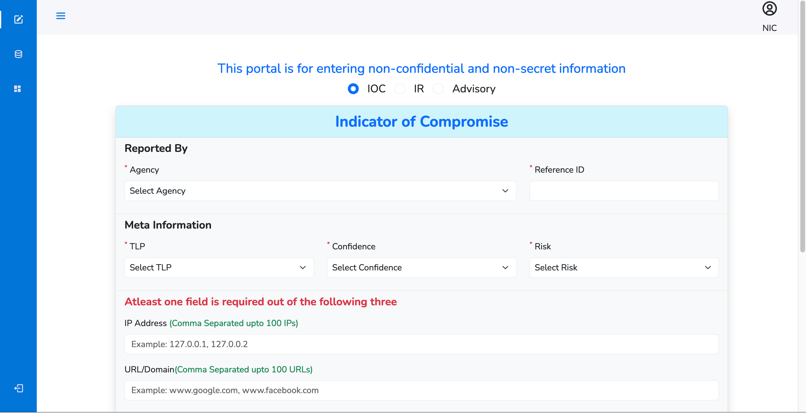

# ATR Portal for NIC Internship

This project was developed for National Informatics Center, Govt. Of India as a part of 2 months summer internship. The portal is used by different ministries to send cyber security threats to NIC.
## API Reference

#### Landing Page

```http
  GET /
```

|  Description                |
|  :------------------------- |
|  Allows Login to Ministries |

#### Loads form to issue tickets

```http
  GET /incident
```

|  Description                |
|  :------------------------- |
|  Allows Ministries to issue a ticket for a threat using three different forms  |

#### Loads track status module for tickets issued

```http
  GET /trackstatus/${pageNumber}
```

| Parameter | Type     | Description                       |
| :-------- | :------- | :-------------------------------- |
| `id`      | `number` | **Required**. Page Number for the tickets to fetch |


## Screenshots



